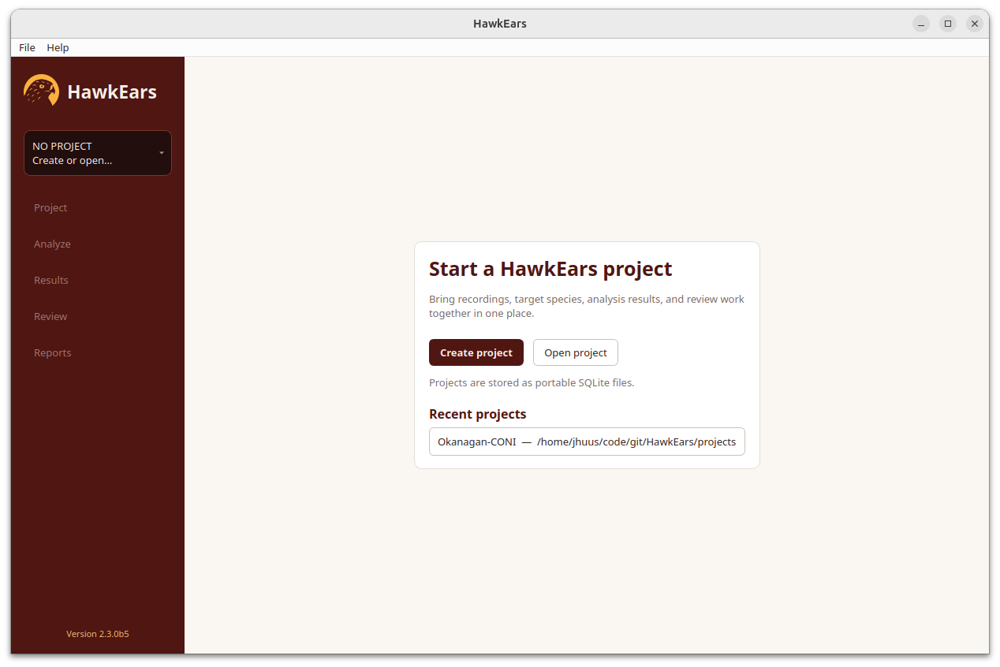
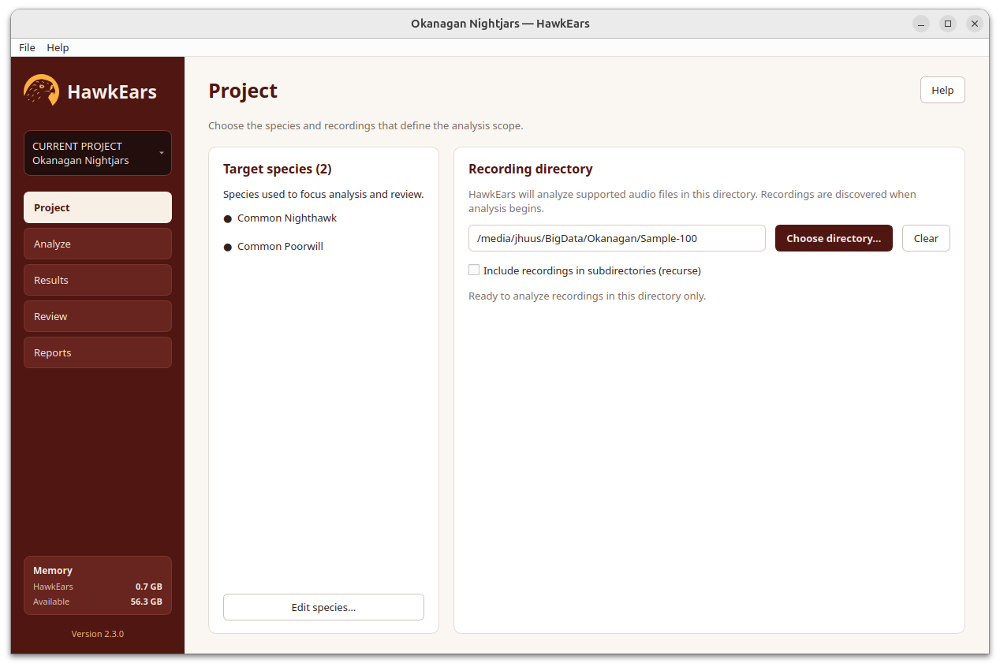
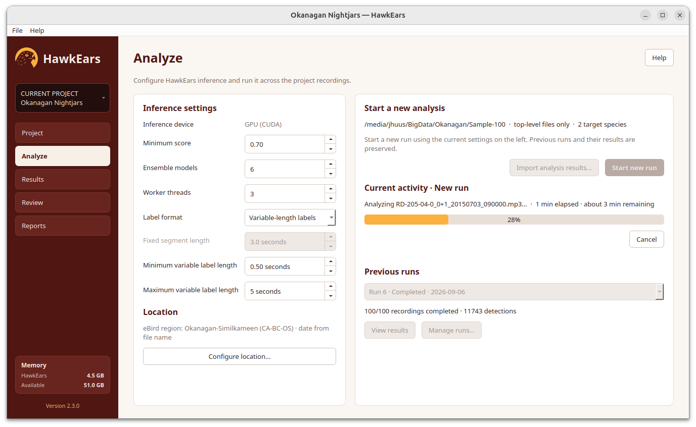
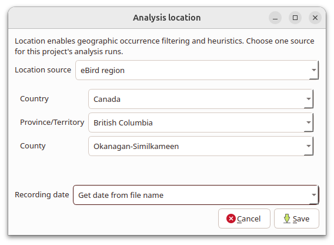
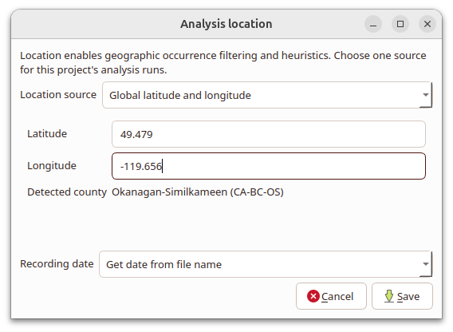
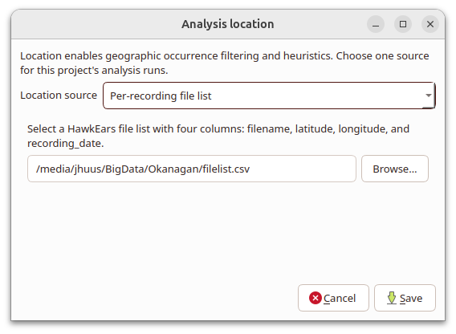
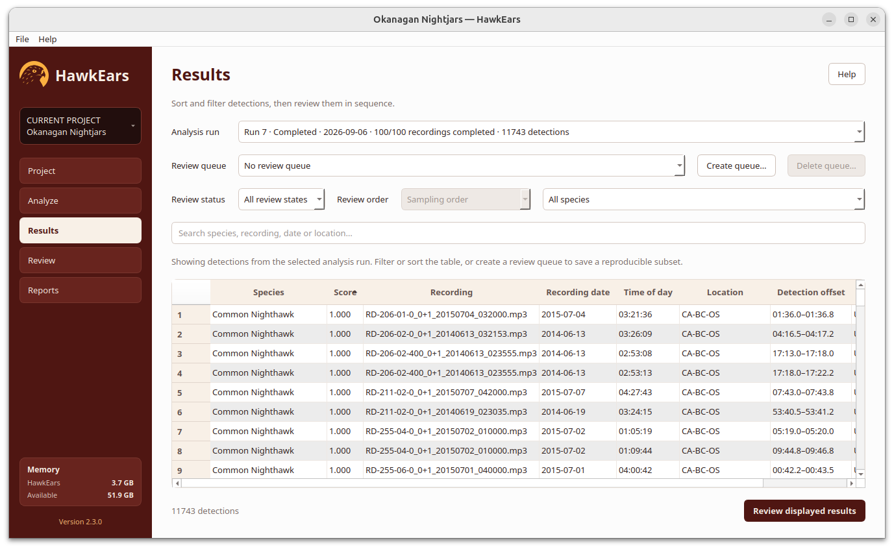
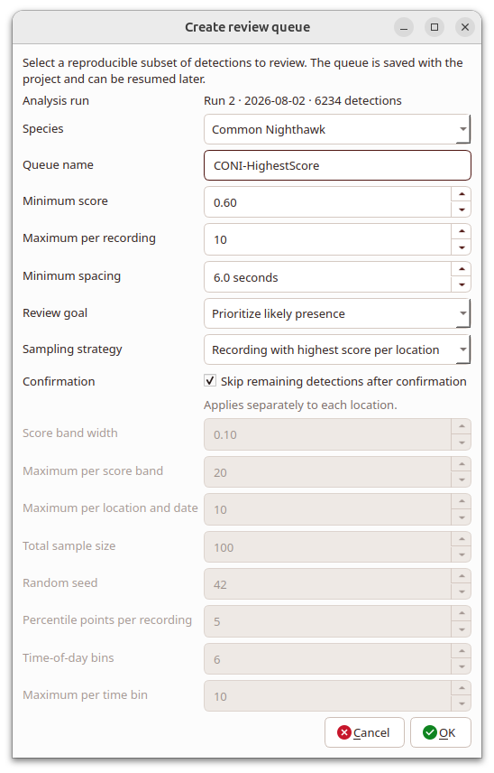
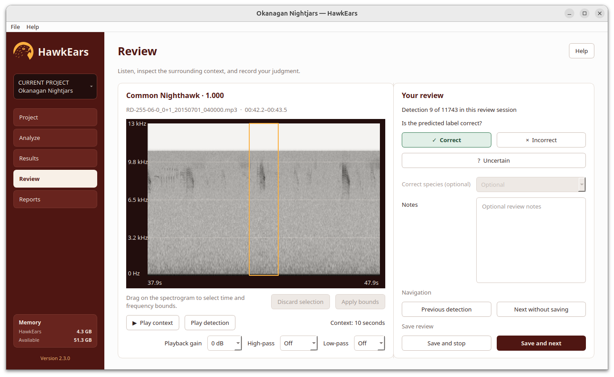
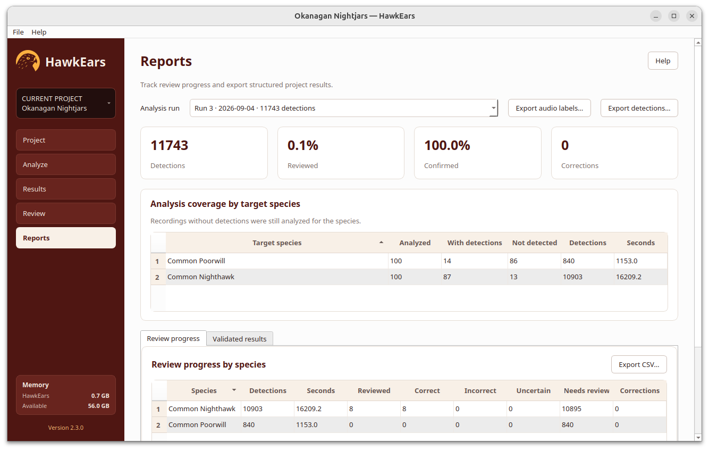

# HawkEars Graphical User Interface (GUI)

## Contents

- [Overview](#overview)
- [Projects](#projects)
- [Analyzing Recordings](#analyzing-recordings)
- [Results](#results)
- [Review Queues](#review-queues)
  - [Common Sampling Parameters](#common-sampling-parameters)
  - [General Review Strategies](#general-review-strategies)
  - [Presence Strategies](#presence-strategies)
  - [Coverage and Calibration Strategies](#coverage-and-calibration-strategies)
  - [Review Order and Confirmation](#review-order-and-confirmation)
- [Reviewing Detections](#reviewing-detections)
- [Reports and Exports](#reports-and-exports)

## Overview

The HawkEars GUI provides a project-based workflow for analyzing recordings, reviewing detections, and exporting reports and labels.

If you used the Windows installer, launch the GUI by double-clicking the shortcut. In this case the first launch will ask where HawkEars data should be installed, and will download the model checkpoints and other resources. If you installed HawkEars using `pip install hawkears`, once you have run `hawkears init` you can launch the GUI by typing `hawkears gui`. In this case, model checkpoints and other resources are downloaded by the `hawkears init` command.

A HawkEars project is stored in a `.hawkears` file. The project contains settings, analysis runs, detections, review queues and review history. It does not contain copies of the audio recordings, so do not move or delete the recordings after adding their directory to a project.

## Projects

Create or open a project from the Welcome page, File menu or project menu in the sidebar. On the Project page:

* Select the target species. These are the species that HawkEars will include in its analysis results.
* Select the directory containing the recordings.
* Enable recursion if recordings in subdirectories should also be analyzed.

Each analysis run stores a snapshot of its settings and target species, so you can change project settings and run another analysis without overwriting earlier results.

## Analyzing Recordings

The Analyze page provides the main inference settings:

* **Minimum score** excludes detections below the specified score.
* **Ensemble models** controls how many neural networks are used. More models generally improve accuracy but take longer.
* **Worker threads** controls how many recordings are processed at the same time. Increasing this value can improve throughput, but also increases memory use.
* **Label format** selects variable-length labels or fixed-length segments.
* **Maximum variable label length** to limit the length of variable-length labels.
* **Fixed segment length** when fixed-length labels are selected.

Location and date information enables geographic occurrence filtering and location-specific heuristics. You can provide one location for all recordings using coordinates or an eBird region, or use a CSV file with per-recording values. The CSV file must include `filename`, `latitude`, `longitude` and `recording_date` columns.

Click **Run analysis** to start a new run. If you click **Cancel**, recordings already in progress will finish and their detections will be saved, but no additional recordings will be started.

You can also import Audacity or CSV output created by the HawkEars command-line interface using **Import analysis results**.

The location dialog is shown when you click **Configure location**:

  
  
  

## Results

The Results page displays detections from an analysis run or review queue. **Time of day** is calculated from the recording timestamp and detection offset, and is shown as `—` when no usable start time is available. **Detection offset** is the detection's position relative to the start of its recording. Results can be filtered by text, species and review status. Click a column heading to sort the table.

To review a single detection, double-click the row or select it and click **Review selected**. If no visible row is selected, the Review tab opens the first visible result.

For a small analysis you may review all detections directly. For a large analysis, create a review queue to select a smaller, reproducible subset.

## Review Queues

A review queue samples detections for one species from one analysis run. Queue membership and its original sampling order are saved in the project, so a review can be stopped and resumed later.

### Common Sampling Parameters

The following parameters apply to every sampling strategy:

* **Species** selects the species whose detections will be sampled. Use separate queues for different species.
* **Minimum score** excludes lower-scoring detections. It cannot be lower than the minimum score used for the analysis run.
* **Maximum per recording** limits the number of selected detections from any one recording.
* **Minimum spacing** prevents selected detections in the same recording from starting too close together. For example, a value of 15 seconds ensures that selected start times are at least 15 seconds apart.

Some strategies display additional parameters:

* **Total sample size** is the target size for a random sample.
* **Random seed** makes random sampling reproducible. The same candidates, settings and seed produce the same queue.
* **Score band width** divides the score range from the minimum score to 1.0 into bands.
* **Maximum per score band** limits selections from each score band.
* **Maximum per location and date** limits selections within each location/date group.
* **Percentile points per recording** specifies how many positions across each recording's score distribution are sampled.
* **Time-of-day bins** divides the 24-hour day into equal periods.
* **Maximum per time bin** limits selections within each time-of-day period.

### General Review Strategies

* **Highest score first** selects the highest-scoring eligible detections within each recording, then presents the queue from highest to lowest score.
* **Chronological by recording** selects the earliest eligible detections within each recording and orders them by recording name and start time.
* **Reproducible random sample** shuffles candidates using the random seed, then selects up to the total sample size while enforcing the per-recording and spacing limits.

### Presence Strategies

These strategies are useful when the main question is whether the target species is present at a site, date or recording. Recordings with no specified location are treated as being at the same unknown location.

* **Recordings with most detected time** ranks recordings by the total unioned duration of their detections. Overlapping detections are not counted twice. Eligible detections are presented chronologically within each recording.
* **Recording with highest score per location** selects the recording containing the strongest detection at each location, then selects its strongest eligible detections.
* **Recording with most detections per location** selects the recording with the largest number of candidate detections at each location.
* **Recording with highest summed score per location** selects the recording whose candidate scores have the largest sum at each location.
* **Earliest dates by location** orders recordings from the earliest available date within each location, selecting strong eligible detections from each recording. Detections without a usable date are omitted.
* **Highest scores for each location and date** groups candidates by location and date, then selects the strongest detections in each group up to the specified group maximum.
* **Earliest detections for each location and date** estimates the time of each detection from the recording date/time and detection offset, then selects the earliest detections in each location/date group. Candidates without a usable date and recording time are omitted.

### Coverage and Calibration Strategies

These strategies distribute review effort across scores, recordings, locations or time periods instead of concentrating only on the strongest detections.

* **Evenly across score bands** divides the eligible score range into bands and samples from the bands in rounds. It prefers different recordings within each band and stops at the maximum per band.
* **Score percentiles within each recording** selects detections nearest evenly spaced points in each recording's score distribution. For example, five points target the minimum, 25th percentile, median, 75th percentile and maximum, subject to spacing and per-recording limits.
* **Coverage across location and date** groups detections by location and date and samples the groups in rounds. It prefers recordings with fewer selections and stops at the maximum per location/date group.
* **Coverage across time of day** places detections into equal time-of-day bins and samples strong detections from each bin while preferring different recordings. Candidates without a usable recording time are omitted.

### Review Order and Confirmation

After creating a queue, **Review order** controls traversal without changing queue membership:

* **Sampling order** preserves the order produced by the sampling strategy.
* **Highest score first** orders the sampled detections by score.
* **Chronological by recording** orders them by recording name and start time.

Some presence strategies can **skip remaining detections after confirmation**. When a detection is marked correct for the queued species, remaining pending detections for the same location, or the same location and date, are marked skipped. Turn off this option if every sampled detection should be reviewed. Skipping is reversible: changing the confirming review or disabling confirmation restores the applicable detections to pending.

## Reviewing Detections

The Review page displays a 10-second spectrogram around the detection. You can:

* Play the complete context or only the detected interval.
* Increase playback gain or apply high-pass and low-pass filters. These controls affect playback only.
* Drag on the spectrogram and click **Apply bounds** to revise the time and frequency bounds.
* Mark the identification Correct, Incorrect or Uncertain.
* Select a corrected species when the predicted species is wrong.
* Add optional notes, then save and stop or save and advance to the next visible result.

Edits create a new detection revision. The original species and bounds remain available for reporting and export.

## Reports and Exports

The Reports page summarizes analysis coverage, review queues and review progress by species. Validated reports include detections by species, presence by recording, presence by date and location, correctness by score range and first detections by species and date. Tables can be exported as CSV files.

**Export reviewed detections** creates a detailed CSV filtered by outcome, species or review queue.

**Export audio labels** creates one Audacity label file or Raven selection table per recording. You can export current reviewed results or the original analysis results, choose species codes, common names or scientific names for labels, and control which review states are included. Existing label files are overwritten by default. Clear **Overwrite existing labels** to stop instead when a planned output file already exists.

  

