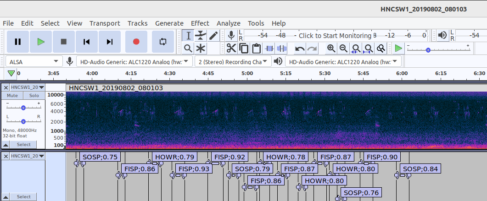

## Introduction
HawkEars is a desktop program that scans audio recordings for bird sounds and generates [Audacity](https://www.audacityteam.org/) label files. It is inspired by [BirdNET](https://github.com/kahst/BirdNET), and intended as an improved productivity tool for analyzing field recordings. This repository includes the source code and trained models for a list of 334 bird species found in Canada and the northern United States. The complete list is found [here](https://github.com/jhuus/HawkEars/blob/main/data/classes.txt). The repository does not include the raw data or spectrograms used to train the model. The class list also include 13 amphibian species found in Canada, but very limited testing has done for them.

If you use HawkEars for your acoustic analyses and research, please cite as:
```
@article{HUUS2025103122,
title = {HawkEars: A regional, high-performance avian acoustic classifier},
author = {Jan Huus and Kevin G. Kelly and Erin M. Bayne and Elly C. Knight},
url = {https://www.sciencedirect.com/science/article/pii/S1574954125001311},
journal = {Ecological Informatics},
pages = {103122},
year = {2025},
issn = {1574-9541},
doi = {https://doi.org/10.1016/j.ecoinf.2025.103122},
}
```

## Installation

To install HawkEars on Linux or Windows:

1.	Install [Python 3](https://www.python.org/downloads/), if you do not already have it installed.
2.	Install git.
3.  Type

```
 git clone https://github.com/jhuus/HawkEars
 cd HawkEars
```

4.	Install required Python libraries:

```
pip install -r requirements.txt
```

5. If you have a [CUDA-compatible NVIDIA GPU](https://developer.nvidia.com/cuda-gpus), such as a Geforce RTX, you can gain a major performance improvement by installing [CUDA](https://docs.nvidia.com/cuda/). If you have an Apple Metal processor, such as an M1 or M2, no CUDA installation is needed. If you have an Intel or AMD processor without a GPU, you can improve inference performance significantly by installing Intel OpenVINO ("pip install openvino"). It will be detected automatically and used by the analyze.py script.

6. If you plan to train your own models, you will need to install SQLite. On Windows, follow [these instructions](https://www.sqlitetutorial.net/download-install-sqlite/). On Linux, type:

```
sudo apt install sqlite3
```

## Analyzing Field Recordings
To run analysis (aka inference), type:

```
python analyze.py -i <input path> -o <output path>
```

The input path can be a directory or a reference to a single audio file, but the output path must be a directory, where the generated Audacity label files will be stored. If no output directory is specified, output will be saved in the input directory. As a quick first test, try:

```
python analyze.py -i recordings
```

This will analyze the recording(s) included in the test directory. There are also a number of optional arguments, which you can review by typing:

```
python analyze.py -h
```

Additional arguments include options for specifying latitude and longitude (or region) and recording date. These are useful for reducing false positives. Classes listed (by common name) in data/ignore.txt are ignored during analysis. By default it includes all the non-bird classes and none of the bird classes.

If you don't have access to additional recordings for testing, one good source is [xeno-canto](https://xeno-canto.org/). Recordings there are generally single-species, however, and therefore somewhat limited. One source of true field recordings, generally with multiple species, is the [Hamilton Bioacoustics Field Recordings](https://archive.org/details/hamiltonbioacousticsfieldrecordings).

After running analysis, you can view the output by opening an audio file in Audacity, clicking File / Import / Labels and selecting the generated label file. Audacity should then look something like this:



By default, species are identified using [4-letter banding codes](https://www.birdpop.org/pages/birdSpeciesCodes.php), but common names can be shown instead using the "-b 0" argument. The numeric suffix on each label is a prediction score, which is not the same as a statistical probability.

To show spectrograms by default in Audacity, click Edit / Preferences / Tracks and set Default View Mode = Spectrogram. You can modify the spectrogram settings under Edit / Preferences / Tracks / Spectrograms.

You can click a label to view or listen to that segment. You can also edit a label if a bird is misidentified, or delete and insert labels, and then export the edited label file for use as input to another process. Label files are simple text files and easy to process for data analysis purposes.

## Limitations
Some bird species are difficult to identify by sound alone. This includes mimics, for obvious reasons, which is why Northern Mockingbird is not currently included in the species list. European Starlings are included, but often mimic other birds and are therefore sometimes challenging to identify.

## Creating Your Own Classifier Using HawkEars
[Here is a detailed description](creating_your_own_classifier.md) of how to create your own classifier using HawkEars.

## Troubleshooting
If analyze.py terminates unexpectedly, it probably ran out of system resources, such as video RAM. To reduce resource usage, add the "--threads 1" parameter. If it still crashes, try reducing the block_size parameter in core/base_config.py.

## User Feedback
If you have any problems during installation or usage, please post an issue here. We would also appreciate any enhancement requests or examples of false positives or false negatives, which can also be posted as issues.

## Implementation Notes
### Neural Networks
HawkEars is implemented using PyTorch, with a primary model ensemble and a separate low-band model (data/low_band.ckpt) to detect Ruffed Grouse drumming. The primary ensemble consists of a group of *.ckpt files stored in data/ckpt. During analysis, predictions are generated using all models in the primary ensemble, and then a simple average of those predictions is used. If you need inference to run faster, and are willing to accept lower accuracy, simply rename one of them to change the suffix. Note that the file name corresponds to the model type specified during training.

### Spectrograms
Spectrograms are extracted from audio files in core/audio.py. The primary models use a mel transform, but the low band model uses linear spectrograms. Spectrogram parameters are specified in core/base_config.py. Training spectrograms are compressed and saved to a SQLite database, but this is not done during inference. The script tools/pickle_spec.py generates a pickle file from spectrograms in a database, given a list of classes. The training code gets input from the pickle file. This improves training performance and makes it easier to share datasets.

### Configuration Management
Configuration parameters, including training hyperparameters, are specified with default settings in core/base_config.py. Groups of alternate settings are specified in core/configs.py. Each group is given a name, so it can be selected using a command-line parameter when running training (this feature is not currently available for inference).

### TensorFlow Version
HawkEars was initially developed using TensorFlow. That code is still available [here](https://github.com/jhuus/HawkEars-TensorFlow). The TensorFlow version is no longer maintained though.

