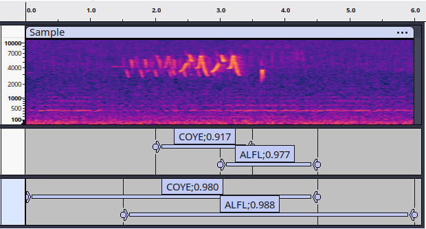

## Introduction
HawkEars is a desktop program that scans audio recordings for bird or amphibian sounds and generates label files formatted for [Audacity](https://www.audacityteam.org/), [Raven](https://www.ravensoundsoftware.com/) or as a CSV file. This repository includes the source code and trained models for a list of 360 bird and 15 amphibian species found in Canada and the northern United States. The complete list is found [here](https://github.com/jhuus/HawkEars/blob/main/install/canada/data/classes.csv). The repository does not include the raw data or spectrograms used to train the model.

If you use HawkEars for your acoustic analyses and research, please cite as:
```
@article{HUUS2025103122,
title = {HawkEars: A regional, high-performance avian acoustic classifier},
author = {Jan Huus and Kevin G. Kelly and Erin M. Bayne and Elly C. Knight},
url = {https://www.sciencedirect.com/science/article/pii/S1574954125001311},
journal = {Ecological Informatics},
pages = {103122},
year = {2025},
issn = {1574-9541},
doi = {https://doi.org/10.1016/j.ecoinf.2025.103122},
}
```

This repository contains HawkEars 2.0 and later versions. Because version 2.0 was a complete rewrite, using all new code based on [BriteKit](https://github.com/jhuus/BriteKit/), we used a new github repository. HawkEars 1.0, which is described in the paper referenced above, is still available [here](https://github.com/jhuus/HawkEars1/). A comparison of HawkEars 1.0 and 2.0 is provided [below](#whats-new-in-hawkears-20).

## Installation

If you have a [CUDA-compatible NVIDIA GPU](https://developer.nvidia.com/cuda-gpus), such as a Geforce RTX, you can gain a major performance improvement by installing [CUDA](https://docs.nvidia.com/cuda/). If you have an Apple Metal processor, such as an M3 or M4, no CUDA installation is needed. If you have an Intel or AMD processor without a GPU, you can improve performance by installing Intel OpenVINO ("pip install openvino").

It is best to install HawkEars in a virtual environment, such as a [Python venv](https://docs.python.org/3/library/venv.html). Once you have that set up, install HawkEars using pip, which is included in Python installations:

```
pip install hawkears
```
In Windows environments, you then need to uninstall and reinstall PyTorch:
```
pip uninstall -y torch torchvision torchaudio
pip install torch torchvision torchaudio --index-url https://download.pytorch.org/whl/cu126
```
Note that cu126 refers to CUDA 12.6.\

Once HawkEars is installed, initialize a working environment using the `init` command:
```
hawkears init
```
This creates and populates several directories under the current working directory, and downloads the model checkpoint files. Use the --dest option to specify an alternative location.
## Analyzing Field Recordings
### Overview
To run analysis (aka inference), type:

```
hawkears analyze -i <input path> -o <output path> <additional options>
```

Available options are listed [below](#command-line-options), and you can view them by typing:

```
hawkears analyze --help
```

The input path can be a directory or a reference to a single audio file, but the output path must be a directory, where the output files will be stored. If no output directory is specified, output will be saved in the input directory. As a quick first test, try:

```
hawkears analyze -i recordings
```

This will analyze the recording(s) included in the recordings directory. The default output format is Audacity. So this example will generate a label file that you can view by opening the recording in Audacity, clicking File / Import / Labels and selecting the generated label file.

### Output Format

The --rtype option lets you specify Audacity, Raven, CSV or a combination. For example, to get Raven and CSV output, specify "--rtype raven+csv".

By default, species are identified using [4-letter banding codes](https://www.birdpop.org/pages/birdSpeciesCodes.php), but common names can be shown instead using the "--label names" option. You can also specify "--label alt-names" for scientific names and "--label alt-codes" for 6-letter codes. The numeric suffix on each label is a score or prediction, which is similar to a probability.

### Including or Excluding Species

By default, labels are generated for birds only. This is because amphibians, mammals and other classes are listed in data/exclude.txt. You can use the --include or --exclude options to control which classes are included in the output. For example, if you are only interested in Ovenbirds and Tennessee Warblers, create a file called, for example, data/my_include.txt with those two names (one per line), and specify "--include data/my_include.txt".

### Location and Date Processing

When possible, you should provide locations and dates to the analyze command. In the simplest case this will filter out bird species that are "too rare" at that location/date. They are considered too rare if their occurrence value falls below the value specified in the min_occurrence config parameter. In some cases, HawkEars uses location and date values to identify a species. For example, if the neural networks identify an Eastern Towhee on the west coast of Canada, HawkEars will switch the ID to Spotted Towhee, since they sound very similar and Eastern Towhee is not found there. There are several ways to provide the location and date, as described in the [Command-line Options](#command-line-options) section.

## Command-line Options
The analyze command has the following options (only --input is required):

* `--input <directory or file name>`
    * Path to input directory or recording.
    * May be abbreviated to -i.
* `--output <directory>`
    * Path to output directory. Defaults to input directory.
    * May be abbreviated to -o.
* `--min_score <value>`
    * Exclude output labels with scores lower than this. Defaults to 0.7.
    * May be abbreviated to -m.
* `--cfg <YAML file>`
    * Path to YAML file defining config overrides.
* `--rtype <YAML file>`
    * Output format type. Options are "audacity", "csv", or "raven". Default="audacity". To get multiple output formats, specify "audacity+csv" for example. Only the first three characters are needed, so you could specify "aud+csv+rav" to get all three output formats.
* `--include <test file>`
    * Path to text file listing common names of classes to include. If specified, exclude all other classes.
* `--exclude <test file>`
    * Path to text file listing common names of classes to exclude. If specified, include all other species. Review the default file in data/exclude.txt, and be sure to specify classes such as Noise and Other, which should always be excluded.
* `--start <seconds>`
    * Specify this if you do want analysis to start somewhere other than the start of the recording. For example, specify "--start 10" to start 10 seconds into the recording.
* `--filelist <CSV file>`
    * In the CSV file, provide four columns: filename, latitude, longitude and recording_date, where the latter is in YYYY-MM-DD format.
* `--region <code>`
    * The code can be any eBird county code or prefix. For example, CA-ON-OT is Ottawa, CA-ON is Ontario and CA is Canada. It's best to provide a specific county when possible.
* `--lat <value>`
    * The latitude. This requires that longitude and date are also specified, and that region is not specified.
* `--lon <value>`
    * The longitude. This requires that latitude and date are also specified, and that region is not specified.
* `--date <argument>`
    * The argument can be a date in YYYY-MM-DD format, or the word "file". If the latter is specified, HawkEars will get dates from the file names, where the date can occur anywhere in the file name in YYYY-MM-DD or YYYYMMDD format.
* `--threads <value>`
    * Number of recordings that will be processed at the same time. Defaults to 3.
* `--seg <seconds>`
    * By default, output labels are variable length. Specify a value here if you want fixed-length output labels.
* `--models <value>`
    * HawkEars analysis uses an ensemble of up to 12 main models (neural networks). Specify a smaller value here for faster performance but slightly reduced accuracy. With a GPU, the default is 12. Otherwise the default is 3.
* `--label <value>`
    * Field used to identify species in output labels.
    * Valid values are "codes" (4-letter banding codes, the default), "names" (common names), "alt_codes" (6-letter banding codes) and "alt_names" (scientific names).

The following are "flag" options, which are used with no corresponding parameter:

* `--recurse`
    * If specified, process sub-directories of the input directory.
* `--top`
    * If specified, show the top scores for the first spectrogram, then stop.
* `--debug`
    * If specified, turn on debug logging.
* `--low-band`
    * If specified, enable the low-band classier used to detect low-frequency Ruffed Grouse drumming and Spruce Grouse wing beats.
* `--no-low-band`
    * If specified, disable the low-band classier used to detect low-frequency Ruffed Grouse drumming and Spruce Grouse wing beats.
* `--quiet`
    * If specified, suppress most console output.

## Configuration
HawkEars is based on [BriteKit](https://github.com/jhuus/BriteKit/) and extends its [YAML](https://yaml.org/)-based configuration system. The analyze command reads default parameters from yaml/default.yaml. In a Linux or Windows environment, if no GPU is detected, analyze then reads yaml/default-cpu.yaml to apply additional overrides. In a Mac environment it reads yaml/default-mps.yaml and applies those overrides.

Any parameters in the audio, infer or misc groups override corresponding BriteKit defaults. The hawkears groups contains HawkEars-specific parameters.

For settings in the audio, infer and misc sections, refer to the [BriteKit documentation](https://github.com/jhuus/BriteKit/blob/master/config-reference.md). The HawkEars-specific settings are in a hawkears section, which contains the following:

* `filelist`
    * Default value for the --filelist option. CSV file with filename, latitude, longitude, recording_date.
* `date`
    * Default value for the --date option. YYYY-MM-DD or "file" to extract from file names.
* `latitude`
    * Default value for the --latitude option.
* `longitude`
    * Default value for the --longitude option.
* `region`
    * Default value for the --region option. eBird county code or prefix, e.g. CA-ON=Ontario, CA-ON-OT=Ottawa.
* `min_occurrence`
    * Ignore species if occurrence less than this for location/week. Default = .0002.
* `lower_min_if_confirmed`
    * Default = true. Controls an inference heuristic that Ignore species if occurrence less than this for location/week. Default = .0002.
* `include_list`
    * Default value for the --include option.
* `exclude_list`
    * Default value for the --exclude option.
* `save_rarities`
    * If true, create a rarities output directory and save labels for low-occurrence classes. Default = false.
* `low_band_classifier`
    * If true, use the low-band classifier in addition to the main classifier. The low-band classifier detects low-frequency Ruffed Grouse drumming and Spruce Grouse wing beats Default = false.

You should not make changes to any of the default YAML files described above. To apply your own overrides, create a file such as yaml/settings.yaml. Then in the analyze command specify `--config yaml/settings.yaml`. For example, you could use a custom YAML file like this so you do not have to set these options at the command-line every time:

```
hawkears:
  latitude: 45.4321
  longitude: -80.0000
  date: file
```

## API
The HawkEars API allows you to call the analyze command from Python like this:

```
import logging
import britekit as bk
import hawkears as he

print(f"HawkEars version={he.__version__}")
cfg = he.get_config()
cfg.infer.max_models = 3

bk.util.set_logging(level=logging.INFO, timestamp=False)
he.commands.analyze(
    input_path="my_input_dir",
    output_path="my_output_dir",
    quiet=True,
)
```

The analyze command is as follows:

```python
analyze(
    cfg_path: Optional[str] = None,
    input_path: str = "",
    output_path: str = "",
    rtype: str = "audacity",
    date: Optional[str] = None,
    region: Optional[str] = None,
    lat: Optional[float] = None,
    lon: Optional[float] = None,
    filelist: Optional[str] = None,
    include: Optional[str] = None,
    exclude: Optional[str] = None,
    start_seconds: float = 0,
    min_score: Optional[float] = None,
    num_threads: Optional[int] = None,
    segment_len: Optional[float] = None,
    label_field: Optional[str] = None,
    recurse: bool = False,
    top: bool = False,
    low_band: Optional[bool] = None,
    quiet: bool = False,
)

Parameters are as follows:
```
    - cfg_path (str, optional): Path to YAML configuration file defining model and inference settings.
    - input_path (str): Path to input audio file or directory containing audio files.
    - output_path (str): Path to output directory where results will be saved.
    - rtype (str, optional): Output format type. Use "audacity", "csv", or "raven", or combine
      with "+" (e.g., "audacity+csv"). Only first three characters needed. Default="audacity".
    - date (str, optional): Date as yyyymmdd, mmdd, or 'file'. Specifying 'file' extracts the date from the file name.
    - region (str, optional): eBird region code, e.g. 'CA-AB' for Alberta. Use as an alternative to latitude/longitude.
    - lat (float, optional): Latitude.
    - lon (float, optional): Longitude.
    - filelist (str, optional): Path to CSV file containing input file names, latitudes and longitudes
      (or region codes) and recording dates.
    - include (str, optional): Path to text file listing species to include. If specified,
      exclude all other species. Defaults to value in config file.
    - exclude (str, optional): Path to text file listing species to exclude.
      Defaults to value in config file.
    - start_seconds (float, optional): Where to start processing each recording, in seconds. Default=0.
    - min_score (float, optional): Confidence threshold. Predictions below this value are excluded.
    - num_threads (int, optional): Number of threads to use for processing.
    - segment_len (float, optional): Fixed segment length in seconds. If specified, labels are
      fixed-length; otherwise they are variable-length.
    - label_field (str, optional): Type of label to output: "codes" (4-letter), "names" (common names),
      "alt_codes" (6-letter), or "alt_names" (scientific names).
    - recurse (bool, optional): If true, process sub-directories of the input directory.
    - top (bool, optional): If true, show the top scores for the first spectrogram, then stop.
    - low_band (bool, optional): If specified, override the default setting to enable or disable the low-band classifier.
    - quiet (bool): If true, suppress most console messages.

## What's New in HawkEars 2.0
HawkEars 2.0 is a complete rewrite based on BriteKit, and it has improvements in many areas, including:

* Accuracy
* Label alignment and granularity
* New species
* New features
* Ease of installation
* Configurability
* Control of inference speed
* API

### Accuracy
As an example of the accuracy improvement in 2.0, here are area-under-curve precision/recall scores from a test with 2300 annotations for 120 species:

| Software | PR-AUC |
|----------|----------|
| BirdNET  | .4818 |
| HawkEars 1.0 | .6941 |The n
| HawkEars 2.0 | .8034 |

### Label Alignment and Granularity
This example shows HawkEars 2.0 labels on top, with HawkEars 1.0 output on the bottom:



Like BirdNET, HawkEars 1.0 never created labels shorter than 3 seconds, and all labels were multiples of 1.5 seconds in length, aligned on 1.5 second boundaries by default. HawkEars 2.0 creates labels in increments of 1/4 second, aligned on 1/4 second boundaries. They are not perfectly aligned, but most of the time the alignment is quite good, as shown above.

### New Species
HawkEars 2.0 adds support for the following new species:

* Amphibians
    * Great Basin Spadefoot
    * Pacific Chorus Frog
* Eastern birds
    * Bicknell’s Thrush (similar to Gray-cheeked Thrush, so location and date are important for identification)
    * Worm-eating Warbler
* Western birds
    * Ancient Murrelet
    * Barrow's Goldeneye (very similar to Common Goldeneye, so location and date are crucial)
    * Black Swift
    * Black-footed Albatross
    * Cassin's Auklet
    * Gray-headed Chickadee
    * Harlequin Duck
    * Hudsonian Godwit
    * Hutton's Vireo
    * Lark Bunting
    * Lewis’s Woodpecker
    * Pacific Loon
    * Pigeon Guillemot
    * Pink-footed Shearwater
    * Rhinoceros Auklet
    * Sage Thrasher
    * Spotted Owl
    * Surfbird
    * Tufted Puffin
    * Wandering Tattler
    * Western Screech-Owl
    * White-headed 	Woodpecker
    * White-tailed Ptarmigan
    * Williamson’s Sapsucker

### New Features
New features include:

* Ability to specify which species to include in the output, which is often easier than specifying which to exclude.
* Ability to output 6-letter species codes or scientific names (or the 4-letter codes or common names already supported in 1.0).
* Ability to save in Raven format.

### Ease of Installation
The installation process is greatly simplified, as described [above](#installation).

### Configurability
System-wide defaults can now be specified in YAML files, as described [above](#configuration).

### Control of Inference Speed
HawkEars 2.0 uses two model ensembles, with 12 models for the main ensemble and 2 for the low-band classifier. Using the --models option, you can specify the number of models to use in the main ensemble, from 1 to 12. Here are the PR-AUC scores for a test with 2300 annotations and 120 species:

| Software | # Models | PR-AUC |
|----------|----------|--------|
| BirdNET  | | .4818 |
| HawkEars 1.0 | | .6941 |
| HawkEars 2.0 | 1 | .6816 |
| HawkEars 2.0 | 2 | .7543 |
| HawkEars 2.0 | 3 | .7726 |
| HawkEars 2.0 | 4 | .7784 |
| HawkEars 2.0 | 5 | .7788 |
| HawkEars 2.0 | 6 | .7794 |
| HawkEars 2.0 | 7 | .7821 |
| HawkEars 2.0 | 8 | .7933 |
| HawkEars 2.0 | 9 | .7969 |
| HawkEars 2.0 | 10 | .7978 |
| HawkEars 2.0 | 11 | .8030 |
| HawkEars 2.0 | 12 | .8034 |

In a GPU environment the default is 12, but in CPU and Mac environments the default is 3, which greatly reduces runtime at a cost of slightly lower accuracy.

### API
HawkEars 1.0 did not have an API, but 2.0 does. Details are [here](#api).

## User Feedback
If you have any problems during installation or usage, please post an issue here. We would also appreciate any enhancement requests or examples of false positives or false negatives, which can also be posted as issues, or in an email to jhuus at gmail dot com.
